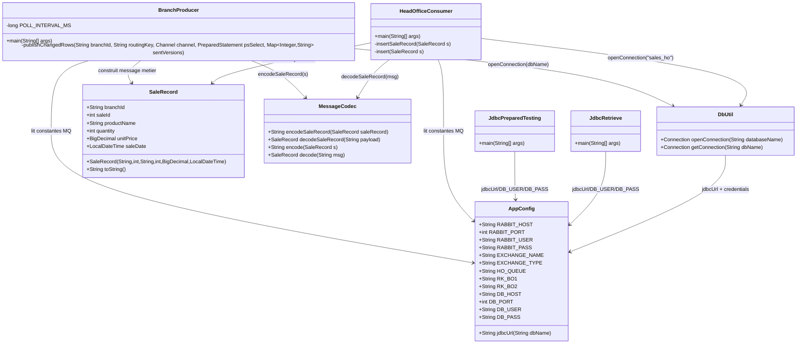
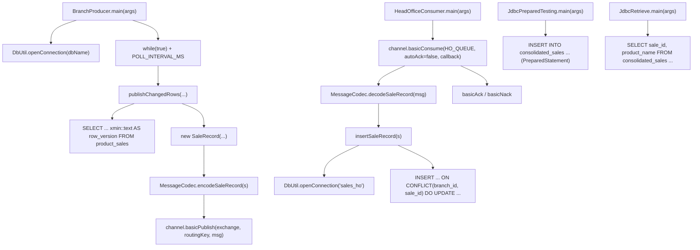
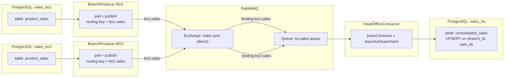
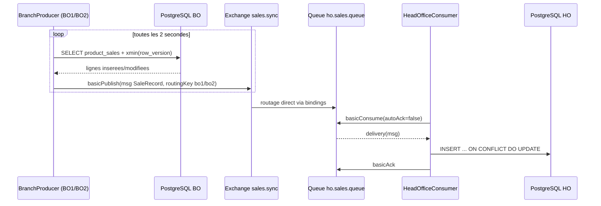

# TP2 - Architecture et Appels

## 1) Carte du code (fichiers, variables, signatures, appels)

### Graphe d'appels (qui appelle quoi)

## 2) Architecture runtime (consumer, channel, exchange, queue)

### Sequence simplifiee (update BO -> update HC)

